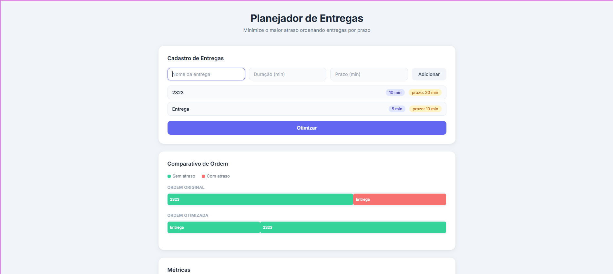
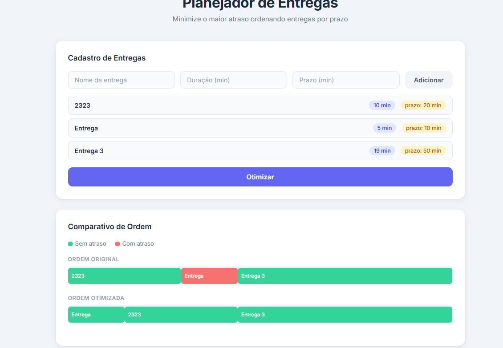
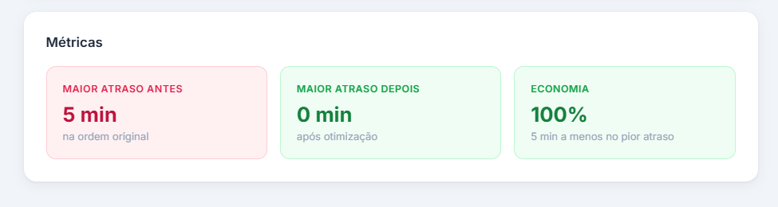

# G47_Greedy_PA-26.1

## Nome do Projeto

**Número da Lista**: 47<br>
**Conteúdo da Disciplina**: Greedy Algorithms<br>

## Alunos

| Matrícula | Aluno                       |
| --------- | --------------------------- |
| 221022060 | Leonardo Fachinello Bonetti |
| 241025784 | João Paulo da Silva Pereira |

---

## Sobre

O projeto tem como objetivo aplicar algoritmos gulosos (*Greedy Algorithms*) para encontrar a ordem com o menor atraso máximo de uma lista de entregas.

---

## Screenshots

### Tela Inicial



### Resultado das Rotas



### Comparação dos Algoritmos



---

## Instalação

**Linguagem**: Python<br>
**Framework**: Flask<br>

### Pré-requisitos

Antes de começar, você precisará ter instalado:

* Python 3.10 ou superior
* pip
* Git

---

### Clone o repositório

```bash
git clone https://github.com/projeto-de-algoritmos-2026/G47_Greedy_PA-26.1.git
```

Entre na pasta do projeto:

```bash
cd G47_Greedy_PA-26.1
```

---

### Criar ambiente virtual

Linux/Mac:

```bash
python3 -m venv venv
source venv/bin/activate
```

Windows:

```bash
python -m venv venv
venv\Scripts\activate
```

---

### Instalar dependências

```bash
pip install -r requirements.txt
```

---

## Execução

### Rodar o backend

Entre na pasta backend:

```bash
cd backend
```

Execute:

```bash
python app.py
```

O servidor iniciará em:

```bash
http://localhost:5000
```

---

### Rodar o frontend

Abra outro terminal e entre na pasta frontend:

```bash
cd frontend
```

Caso utilize Live Server:

```bash
Clique com o botão direito em index.html → Open with Live Server
```

Ou abra diretamente o arquivo `index.html` no navegador.

---


---

## Tecnologias Utilizadas

* Python
* Flask
* React
* HTML
* CSS
* JavaScript

---

## Outros

Este projeto foi desenvolvido para a disciplina de Projeto de Algoritmos da Universidade de Brasília (UnB), com foco na aplicação prática de algoritmos gulosos em problemas de grafos e otimização de caminhos.

Repositório oficial:

[G47_Greedy_PA-26.1](https://github.com/projeto-de-algoritmos-2026/G47_Greedy_PA-26.1.git)
